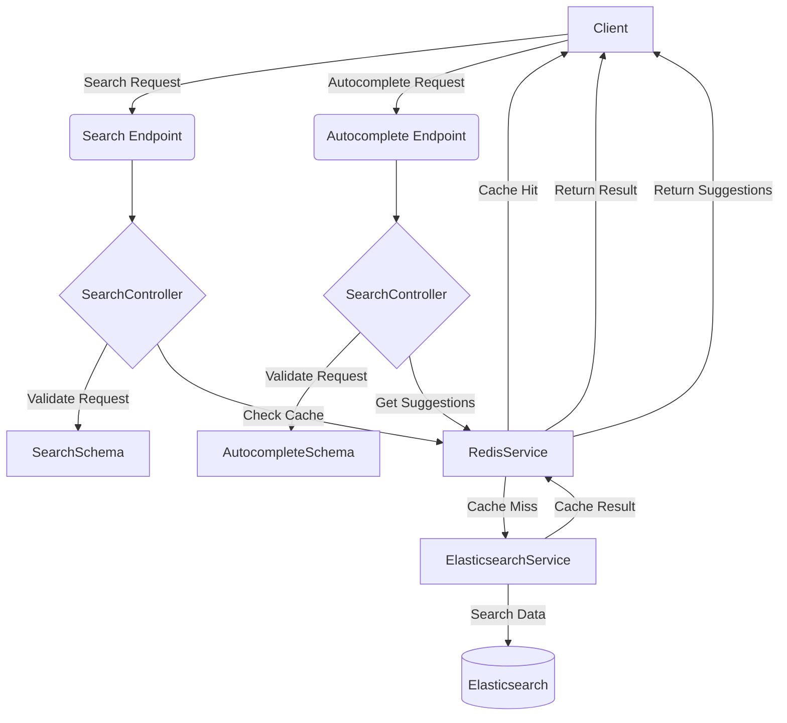

## Search Engine backend

이 프로젝트는 Elasticsearch와 Redis를 활용하여 자동완성 기능을 제공하는 검색 엔진 백엔드입니다.

### Flow Chart



1. **검색 요청 처리** :

- 클라이언트가 서버에 검색 요청을 보냅니다.

- 서버는 Redis 캐시에서 검색어를 먼저 조회합니다.

- 캐시에 검색어가 있다면 캐시된 결과를 반환합니다.

- 캐시에 검색어가 없다면 Elasticsearch에서 검색을 수행하고 결과를 Redis에 캐시한 후 클라이언트에 반환합니다.
  - 데이터가 업데이트되었다면 캐시를 삭제합니다.

2. **자동완성 요청 처리** :

- 클라이언트가 서버에 자동완성 요청을 보냅니다.

- 서버는 Redis에서 자동완성 제안을 조회합니다.

- 조회된 제안을 클라이언트에 반환합니다.

### 주요 메서드 설명

1. **SearchController** :

- `search`: 클라이언트의 검색 요청을 처리하고, 결과를 반환합니다.

- `autocomplete`: 자동완성 요청을 처리하고, 결과를 반환합니다.

2. **ElasticsearchService** :

- `search`: Elasticsearch에서 검색을 수행합니다.

- `indexDocument`: Elasticsearch에 문서를 인덱싱합니다. 데이터가 업데이트되면 관련된 캐시 데이터를 무효화합니다.

3. **RedisService** :

- `getCache`: Redis에서 캐시된 검색 결과를 조회합니다.

- `setCache`: 검색 결과를 Redis에 캐시합니다.

- `delCache`: 특정 키에 대한 캐시 데이터를 삭제합니다.

- `getAutocompleteSuggestions`: Redis에서 자동완성 제안을 조회합니다.

- `addAutocompleteSuggestion`: 자동완성 제안을 Redis에 추가합니다.

### 프로젝트 실행 명령어

1. **환경 변수 설정** :

- `.env` 파일을 생성하고 필요한 환경 변수를 설정합니다. 예를 들어 Elasticsearch 및 Redis 설정, 포트 번호 등을 설정합니다.

```base
# Server configuration
PORT=3000

# Redis configuration
REDIS_HOST=redis
REDIS_PORT=6379

# Elasticsearch configuration
ELASTICSEARCH_URL=http://elasticsearch:9200
```

2. **Docker Compose 사용하여 실행** :

- Docker 및 Docker Compose를 사용하여 모든 서비스를 실행할 수 있습니다.

```sh
docker-compose up --build
```

3. **개발 환경에서 직접 실행** :

- Node.js 환경에서 직접 서버를 실행하려면, 다음 명령어를 사용합니다.
  프로젝트 개발에는 `bun`을 사용하였습니다.
  docker로 실행될 때에는 `npm`으로 작업이 진행됩니다.

```sh
bun install
bun run build
bun run start
```

### 사용된 기술 및 스택

이 프로젝트에서 사용된 주요 기술과 스택은 다음과 같습니다:

- **Node.js**

- **Express**

- **Elasticsearch**

- **Redis**

- **Docker**

- **Docker Compose**

### 폴더 구조

```lua
.
├── Dockerfile
├── README.md
├── bun.lockb
├── docker-compose.yml
├── package-lock.json
├── package.json
├── src
│   ├── app.ts
│   ├── controllers
│   │   └── searchController.ts
│   ├── routes
│   │   └── searchRoutes.ts
│   ├── schemas
│   │   └── searchSchemas.ts
│   ├── scripts
│   │   ├── seed.js
│   │   └── seed.ts
│   ├── server.ts
│   └── services
│       ├── elasticsearchService.ts
│       └── redisService.ts
└── tsconfig.json
```

